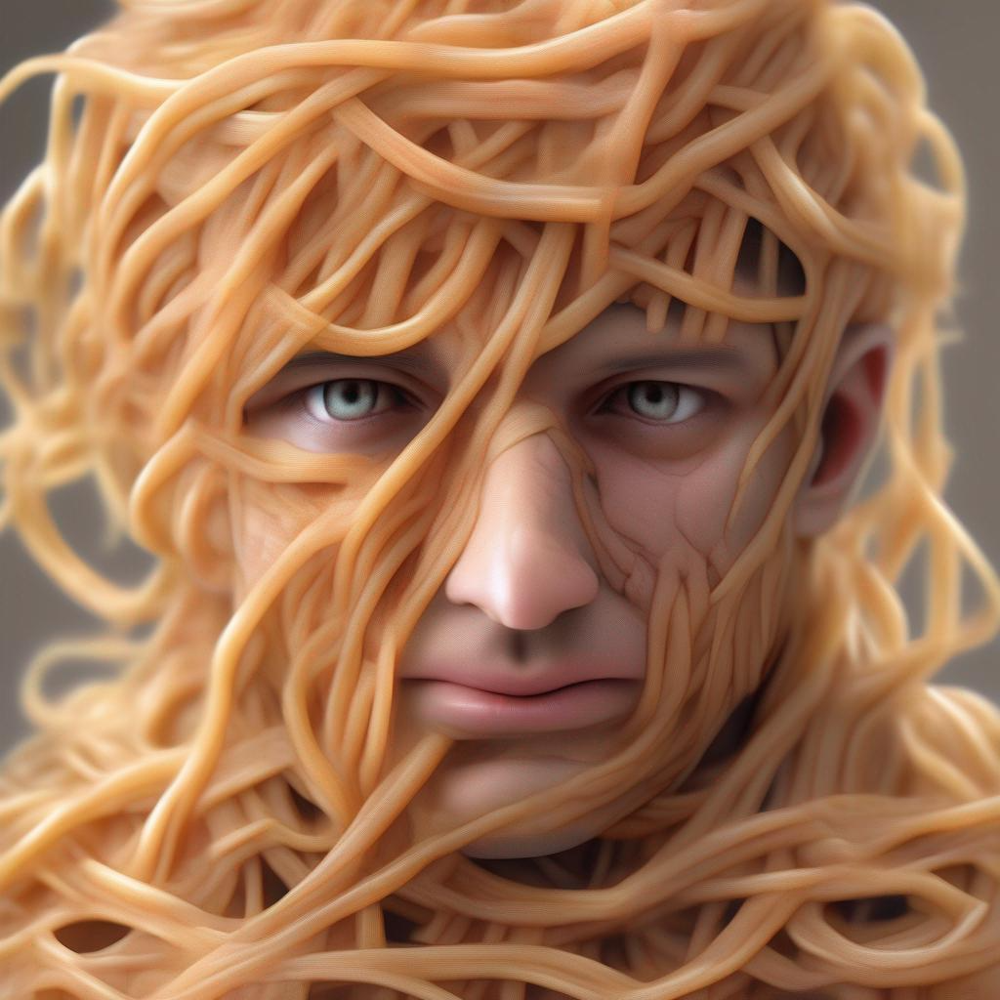
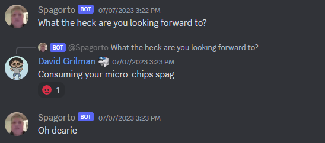

 

  

  <h3 align="center">Spagorto Bot</h3>

  

    A discord bot that is mentally challenged 
     
     
    <a href="https://github.com/Jake-mc221/Spag/issues">Report Bug</a>
    .
    <a href="https://github.com/Jake-mc221/Spag/issues">Request Feature</a>
  

    

## Table Of Contents

* [About the Project](#about-the-project)
* [Commads](#commands)
* [Contributing](#contributing)
* [Authors](#authors)
* [Planned Features](#planned-features)

## About The Project

🤖 Spagorto

Spagorto started off as a little side project for my friends discord. The idea was simple, train a language model on random data to proved hilarious out of pocket responses. Over time, as development progressed, Spagorto evolved into a versatile Discord bot, incorporating a myriad of advanced features. The following highlights merely scratch the surface of its extensive capabilities. 

🎵 Music 

Beyond his linguistic prowess, Spagorto moonlights as your server's musical conductor. Use his API-powered music playback feature to orchestrate your favorite tunes or discover new beats seamlessly integrated into your gaming sessions.

## Commands

### Image Commands

- **`!pfp`**: Displays a users pfp with @ (if left blank it will deafult to the current users pfp)
- **`!fast`**: Apply a fast blur filter to an image.
- **`!swirl`**: Add a swirl effect to an image.
- **`!blur`**: Apply a blur effect to an image.
- **`!deepfry`**: Deep fry an image for a humorous effect.
- **`!implode`**: Create an implode effect on an image.
- **`!oilpaint`**: Transform an image into an oil painting style.
- **`!meme`**: Generate a meme using the provided text.
- **`!dis`**: Apply a distortion effect to an image.

### React Commands

- **`!ratio`**: Ratio a user 
- **`!clown`**: Clown a user 

### AI Commands

- **`!gen`**: Generate text using AI.
- **`!talk`**: Make the AI talk

### Misc Commands

- **`!download`**: Download a video.
- **`!anon`**: Send an anonymous message.
- **`!porn`**: 
- **`!status`**: Set the status of the bot.
- **`!big`**: Enlarge an emoji
- **`!rev`**: Reverse text.
- **`!greentext`**: Generate a greentext with or without a prompt 
- **`!settemp`**: Sets the creativity rate for spag
- **`!roll`**: Roll the dice!

### Music Commands

- **`!play`**: Play music from youtube. 

## Panned Features 
- Continuous learning based on chat logs
- Better image generation 
- Fully functional voice chat integration (being able to talk to the bot)
- More image commands 
- Expansion of web scraping capabilities
- Greentext generation 
- Database integration 
- Bark integration

## Authors

* **Jake McAndrew** - *Comp Sci Student* - [Jake McAndrew](https://github.com/Jake-mc221) - *Sole spag dev*
